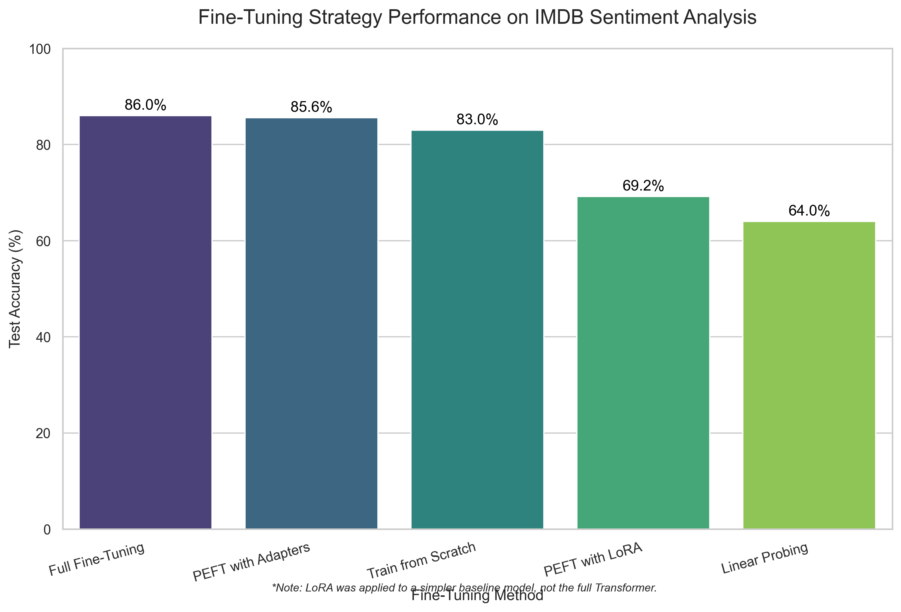
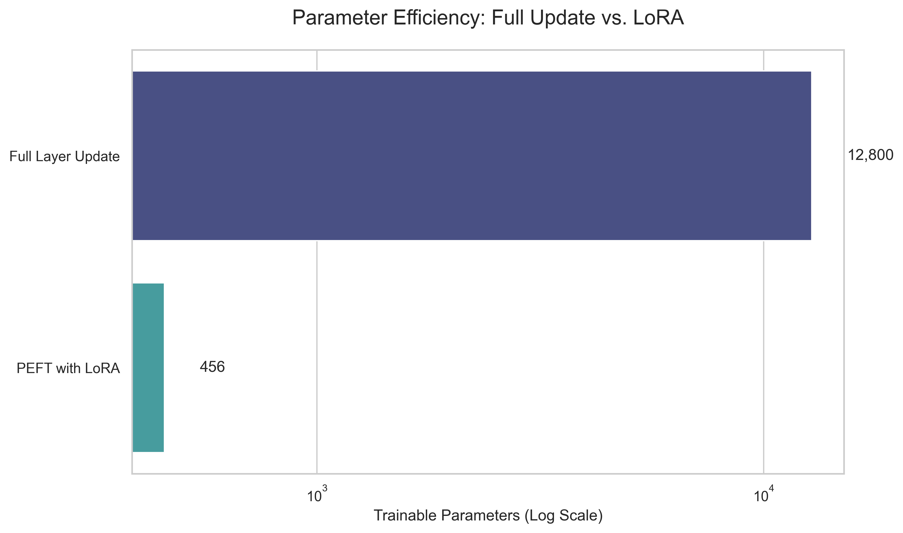
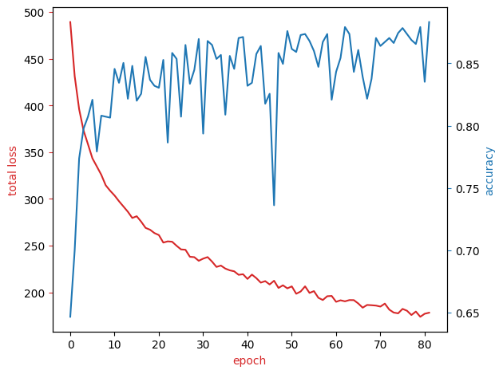
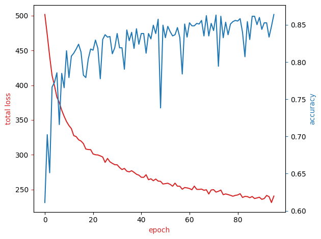
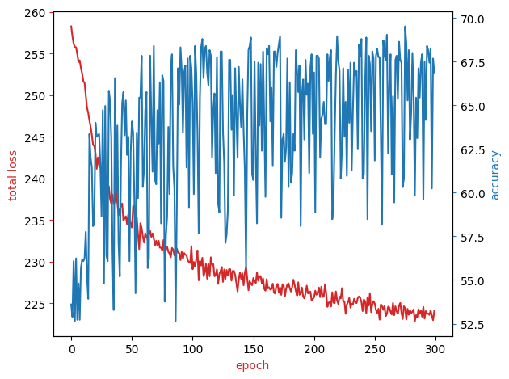
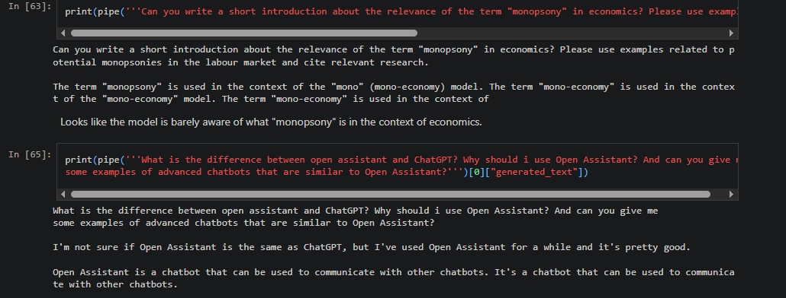
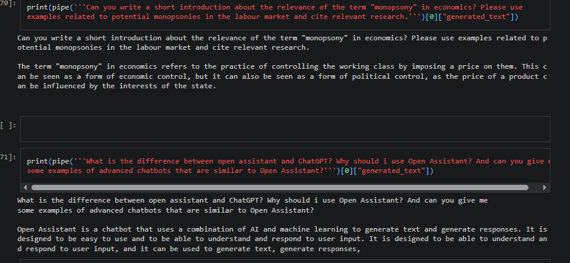

# The Transformer Adaptation Playbook
### *An Empirical Study of Fine-Tuning Techniques: From First Principles to State-of-the-Art PEFT*

<div align="center">

[](https://python.org)
[](https://pytorch.org)
[](https://huggingface.co)
[](LICENSE)

*A systematic, empirical investigation into the trade-offs between performance, computational cost, and parameter efficiency across foundational and state-of-the-art Transformer adaptation methods - built from first principles.*

</div>

---

## Table of Contents

- [Project Philosophy](#-project-philosophy)
- [Key Results & Empirical Analysis](#-key-results--empirical-analysis)
- [First-Principles Engineering Highlights](#-first-principles-engineering-highlights)
- [Repository Architecture](#-repository-architecture)
- [Methodology & Experimental Design](#-methodology--experimental-design)
- [Notebook Deep-Dives](#-notebook-deep-dives)
- [Technologies & Skills Demonstrated](#️-technologies--skills-demonstrated)
- [Reproduction & Setup](#-reproduction--setup)

---

## Project Philosophy

This repository is built on a single conviction: **you cannot truly understand a system you have not built yourself.** Rather than treating pre-trained models as black boxes, this project adopts a *first-principles engineering approach* - deconstructing each adaptation technique to its mathematical core before integrating it into a working system.

The project spans the full spectrum of Transformer adaptation: from training a model on raw text data with a hand-coded positional encoding scheme, to surgically injecting parameter-efficient modules into frozen model internals, to instruction-tuning a decoder model for conversational AI.

**What makes this different from a tutorial:**
- Core components (Positional Encoding, PEFT Adapters, LoRA layers) are **implemented from mathematical definitions**, not imported from convenience libraries.
- All methods are evaluated on a **common benchmark** (IMDB sentiment analysis) to enable direct, apples-to-apples comparison.
- The code explicitly shows *which parameters are frozen, which are trained, and why* - every `requires_grad` flag is intentional.

---

## Key Results & Empirical Analysis

The central finding of this study is that **Parameter-Efficient Fine-Tuning (PEFT) methods can match full fine-tuning performance at a fraction of the parameter cost.**

### Performance: PEFT with Adapters Matches Full Fine-Tuning

<p align="center">
  
</p>

> **Figure 1:** Empirical accuracy on the IMDB test set (25,000 samples) across all adaptation strategies. Both Full Fine-Tuning and PEFT with Adapters achieve ~86%, while Linear Probing stalls at 64% - demonstrating that frozen Transformer representations are insufficient on their own for domain transfer. The LoRA result (69.2%) reflects application to a simpler baseline architecture; see the [LoRA notebook](#notebook-05--peft-deep-dive-lora-from-scratch) for full analysis.

---

### Efficiency: >96% Parameter Reduction with LoRA

<p align="center">
  
</p>

> **Figure 2:** A log-scale comparison of trainable parameters in the adapted layer. The LoRA decomposition reduces the target layer from **12,800 parameters** to just **456** - a **96.4% reduction** - while still improving test accuracy over the from-scratch baseline.

---

### Consolidated Results Table

| Fine-Tuning Method | Test Accuracy | Trainable Params | Efficiency Insight |
|:---|:---:|:---:|:---|
| **Full Fine-Tuning** | **86.0%** | ~1,280,000 | Peak performance; high compute cost |
| **PEFT with Adapters** | **85.6%** | ~100,000 | Matches full fine-tuning; 92% param reduction |
| PEFT with LoRA | 69.2% | 456 (target layer) | 96.4% param reduction; applied to simpler arch |
| Train from Scratch | 83.0% | ~1,280,000 | Strong baseline; no pretrained knowledge |
| Linear Probing | 64.0% | ~1,000 | Fast, but frozen representations are insufficient |

> **Key Takeaway:** The Adapter experiment is the most directly comparable result. It demonstrates that we can achieve within 0.4% of full fine-tuning performance while training an order of magnitude fewer parameters. The LoRA result, while lower in absolute accuracy, is arguably more technically interesting: it achieves a *better-than-scratch result* by updating only 456 parameters in a dense layer that has 12,800.

---

## First-Principles Engineering Highlights

This section documents the specific components that were implemented from mathematical first principles - without relying on high-level abstractions from libraries.

### 1. Sinusoidal Positional Encoding - From the Vaswani et al. Formula

The positional encoding scheme from *"Attention Is All You Need"* was implemented directly from the mathematical definition using PyTorch tensor operations.

```python
class PositionalEncoding(nn.Module):
    def __init__(self, d_model: int, max_len: int = 5000, dropout: float = 0.1):
        super().__init__()
        self.dropout = nn.Dropout(p=dropout)

        pe = torch.zeros(max_len, d_model)
        position = torch.arange(0, max_len, dtype=torch.float).unsqueeze(1)  # [max_len, 1]

        # Numerically stable computation using exp(log(...)) identity
        div_term = torch.exp(
            torch.arange(0, d_model, 2).float() * (-math.log(10000.0) / d_model)
        )  # [d_model/2]

        pe[:, 0::2] = torch.sin(position * div_term)  # Even indices: sin
        pe[:, 1::2] = torch.cos(position * div_term)  # Odd indices: cos

        pe = pe.unsqueeze(0)  # [1, max_len, d_model] - ready for broadcasting
        self.register_buffer('pe', pe)  # Not a parameter; saved with model state
```

**Key design decisions made explicit:**
- The `div_term` is computed via `exp(log(...))` rather than direct power - a numerically stable formulation.
- `register_buffer` is used instead of `nn.Parameter` because positional encodings are *fixed* - they should be part of the model state but not updated by the optimizer.
- The `unsqueeze(0)` prepares the encoding for broadcasting across a batch dimension.

---

### 2. PEFT Adapter Modules - Bottleneck Architecture from Scratch

The Adapter modules introduced by [Houlsby et al., 2019](https://arxiv.org/abs/1902.00751) were implemented entirely in PyTorch without using the HuggingFace `peft` library. Two classes were engineered:

**`FeatureAdapter` - The core bottleneck module:**

```python
class FeatureAdapter(nn.Module):
    """
    A bottleneck adapter: projects down -> nonlinearity -> projects up -> residual.
    Only these weights are trained; the base model stays frozen.
    """
    def __init__(self, model_dim: int, bottleneck_size: int = 64):
        super().__init__()
        self.bottleneck_transform = nn.Sequential(
            nn.Linear(model_dim, bottleneck_size),  # Down-projection
            nn.ReLU(),
            nn.Linear(bottleneck_size, model_dim)   # Up-projection
        )

    def forward(self, x: torch.Tensor) -> torch.Tensor:
        adjustment = self.bottleneck_transform(x)
        return x + adjustment  # Residual connection preserves pre-trained representations
```

**`Adapted` - The surgical injection wrapper:**

```python
class Adapted(nn.Module):
    """
    Wraps a frozen nn.Linear layer with a trainable FeatureAdapter.
    Enables modular, non-destructive insertion of adapters into any architecture.
    """
    def __init__(self, linear_layer, bottleneck_size=None):
        super().__init__()
        self.linear = linear_layer          # The original frozen layer
        model_dim = self.linear.out_features
        if bottleneck_size is None:
            bottleneck_size = model_dim // 2
        self.adaptor = FeatureAdapter(model_dim=model_dim, bottleneck_size=bottleneck_size)

    def forward(self, x: torch.Tensor) -> torch.Tensor:
        linear_output = self.linear(x)     # Pass through frozen pretrained weights
        return self.adaptor(linear_output) # Apply trainable adapter on top
```

**Surgical injection into the Transformer's feed-forward sub-layers:**

```python
for n in range(N_layers):
    encoder = model_adapters.transformer_encoder.layers[n]
    encoder.linear1 = Adapted(encoder.linear1, bottleneck_size=24)
    encoder.linear2 = Adapted(encoder.linear2, bottleneck_size=24)
```

This replaces the `linear1` and `linear2` layers of each `TransformerEncoderLayer` in-place, while leaving all other components (self-attention, layer norms) completely untouched.

---

### 3. LoRA (Low-Rank Adaptation) - Matrix Decomposition from Scratch

The LoRA technique from [Hu et al., 2022](https://arxiv.org/abs/2106.09685) was implemented from its mathematical definition: instead of updating a full weight matrix `W`, we learn a low-rank decomposition `ΔW = B × A`, where `rank(B×A) << rank(W)`.

```python
class LoRALayer(torch.nn.Module):
    def __init__(self, in_dim, out_dim, rank, alpha):
        super().__init__()
        std_dev = 1 / torch.sqrt(torch.tensor(rank).float())
        # A: initialized with Gaussian noise; B: initialized to zero
        # This ensures ΔW = 0 at the start of training (stable initialization)
        self.A = torch.nn.Parameter(torch.randn(in_dim, rank) * std_dev)
        self.B = torch.nn.Parameter(torch.zeros(rank, out_dim))
        self.alpha = alpha

    def forward(self, x):
        # x @ A: [batch, in_dim] -> [batch, rank]
        # @ B:   [batch, rank]   -> [batch, out_dim]
        return self.alpha * (x @ self.A @ self.B)
```

```python
class LinearWithLoRA(torch.nn.Module):
    def __init__(self, linear, rank, alpha):
        super().__init__()
        self.linear = linear   # Frozen pretrained weights W₀
        self.lora = LoRALayer(linear.in_features, linear.out_features, rank, alpha)

    def forward(self, x):
        # W'x = W₀x + ΔWx = W₀x + α(xAB)
        return self.linear(x) + self.lora(x)
```

**The rank concept was also explored empirically using matrix algebra:**
The notebook includes a geometric visualization of matrix rank, demonstrating via NumPy's `matrix_rank` and `null_space` computations that for matrices `B` (d×r) and `A` (r×n) both of rank `r`, the product `C = B@A` has the same rank - the mathematical foundation for why LoRA works.

**Parameter reduction quantified:**

| Component | Parameters |
|:---|:---:|
| Full `fc1` weight matrix (100×128) | **12,800** |
| LoRA matrices A (100×2) + B (2×128) | **456** |
| **Reduction** | **96.4%** |

---

### 4. Tokenizer Training from Scratch

Beyond adapting models, Notebook 03 trains a **custom WordPiece tokenizer** on the WikiText-2 corpus using HuggingFace's `tokenizers` library, demonstrating how vocabulary is built from raw text:

```python
bert_tokenizer = BertTokenizerFast.from_pretrained("bert-base-uncased")
bert_tokenizer = bert_tokenizer.train_new_from_iterator(
    text_iterator=batch_iterator(), 
    vocab_size=30522
)
# Result: domain-specific vocabulary of 12,576 tokens from the corpus
```

---

### 5. Pre-training with Masked Language Modeling (MLM)

A `BertForMaskedLM` model was configured from scratch using a custom `BertConfig` and pre-trained on WikiText-2 using the `DataCollatorForLanguageModeling` with a 15% masking probability - the same self-supervised objective used to train the original BERT.

---

### 6. Instruction-Tuning a Decoder with `SFTTrainer`

Notebook 06 instruction-tunes `facebook/opt-350m` on the `timdettmers/openassistant-guanaco` dataset using the `DataCollatorForCompletionOnlyLM` - which masks the human turn during loss computation so the model only learns to generate assistant responses, not to predict the prompt.

---

## Repository Architecture

```
Transformer-Adaptation-Playbook/
│
├── 01_Pretraining_and_Full_Finetuning.ipynb   # Custom Transformer + Transfer Learning
├── 02_Inference_with_HuggingFace.ipynb         # HuggingFace pipeline() cookbook
├── 03_Building_a_LM_from_Scratch.ipynb         # Tokenizer training + BERT MLM pretraining
├── 04_PEFT_with_Adapters_vs_Full_Finetuning.ipynb  # Adapter PEFT implementation
├── 05_PEFT_Deep_Dive_into_LoRA_Scratch.ipynb   # LoRA from scratch + matrix rank theory
├── 06_Advanced_Finetuning_BERT_to_OPT.ipynb    # BERT classification + OPT SFT
│
├── plots/
│   ├── performance_comparison_imdb.png
│   └── parameter_efficiency_comparison.png
├── 01_plots/ ... 06_plots/                     # Per-notebook training curves
│
├── comparision.py                                  # Script to generate summary plots
└── requirements.txt
```

---

## Methodology & Experimental Design

The experimental design follows a controlled, single-variable methodology: all adaptation strategies are evaluated on the **same task** (IMDB binary sentiment classification), the **same test set** (25,000 samples), and using **the same base architecture** where possible - enabling direct comparison.

```
┌─────────────────────────────────────────────────────────────────┐
│                    EXPERIMENTAL PIPELINE                        │
│                                                                 │
│  Source Task          │  Adaptation Method   │  Target Task     │
│  (AG News, 4-class)   │                      │  (IMDB, 2-class) │
│  ─────────────────────┼──────────────────────┼────────────────  │
│  Pre-trained model    │  Full Fine-Tuning    │  86.0% accuracy  │
│  Pre-trained model    │  PEFT (Adapters)     │  85.6% accuracy  │
│  Pre-trained model    │  Linear Probing      │  64.0% accuracy  │
│  No pretraining       │  Train from Scratch  │  83.0% accuracy  │
│  AG News pretrained   │  PEFT (LoRA)         │  69.2% accuracy  │
└─────────────────────────────────────────────────────────────────┘
```

**Training details (consistent across experiments):**
- Optimizer: SGD with gradient clipping (`max_norm=0.1`)
- LR Schedule: StepLR with `gamma=0.1`
- Embeddings: Pre-trained GloVe 6B 100d vectors (frozen during fine-tuning)
- Batch size: 32 (Transformer experiments), 64 (LoRA/TextClassifier experiments)
- All GPU-trained models: 100 epochs on full IMDB training set

---

## Notebook Deep-Dives

### Notebook 01 - Pre-training & Full Fine-Tuning

**Core contribution:** Establishes the performance baseline for all subsequent experiments. A custom `Net` class wraps PyTorch's `nn.TransformerEncoder` with a hand-coded `PositionalEncoding` module and GloVe-initialized embeddings. The model is first pre-trained on AG News (4-class news classification, ~90% accuracy) then fine-tuned on IMDB.

**Data flow:**
```
Raw Text -> Basic English Tokenizer -> GloVe vocab lookup
-> [batch, seq_len] -> Embedding [batch, seq_len, 100]
-> PositionalEncoding [batch, seq_len, 100]
-> TransformerEncoder (2 layers, nhead=2, d_ff=128) [batch, seq_len, 100]
-> Mean Pool [batch, 100] -> Linear Classifier [batch, 2]
```

**Fine-tuning protocol:** The AG News classifier's final layer (`Linear(100, 4)`) is replaced with `Linear(100, 2)` to adapt to the binary IMDB task, and all parameters are unfrozen for full fine-tuning.

[](./01_Pretraining_and_Full_Finetuning.ipynb)

---

### Notebook 02 - Inference with HuggingFace

**Core contribution:** A practical reference demonstrating both the low-level (manual tokenization -> logits -> softmax -> argmax) and high-level (`pipeline()`) inference workflows across multiple NLP tasks:

| Task | Model | Key Insight |
|:---|:---|:---|
| Sentiment Analysis | `distilbert-base-uncased-finetuned-sst-2-english` | Manual logit inspection |
| Text Generation | `gpt2` | Autoregressive token-by-token generation |
| Translation | `t5-small` | Encoder-decoder with task prefix |
| Language Detection | `papluca/xlm-roberta-base-language-detection` | Cross-lingual representations |
| Fill-Mask | `bert-base-uncased` | MLM inference (0.41 confidence on "paris") |

---

### Notebook 03 - Building a Language Model from Scratch

**Core contribution:** Demystifies BERT pre-training by executing every step of the pipeline:

1. **Data:** WikiText-2 (1,000 train / 200 test samples used for iteration speed)
2. **Custom tokenizer:** Trained from scratch on WikiText-2 corpus -> 12,576-token vocabulary
3. **Model configuration:** `BertConfig` with `hidden_size=768`, `num_hidden_layers=12`, `num_attention_heads=12`
4. **Pre-training objective:** `DataCollatorForLanguageModeling` with `mlm_probability=0.15`
5. **Training:** HuggingFace `Trainer` API with evaluation every epoch

**Qualitative comparison - Fill-Mask on *"This is a [MASK] movie!"*:**

| Model | Top Prediction | Confidence |
|:---|:---|:---:|
| Our from-scratch model | `/` (punctuation) | 5.5% |
| `bert-base-uncased` (pretrained) | `great` | 16% |

The stark difference in prediction quality illustrates *why scale and data matter* in pre-training - our model was trained on a small corpus for few epochs, while the reference BERT was trained on BooksCorpus + Wikipedia.

---

### Notebook 04 - PEFT with Adapters vs. Full Fine-Tuning

**Core contribution:** The most directly comparable PEFT result in the study. Implements `FeatureAdapter` and `Adapted` from scratch (see [First-Principles Highlights](#-first-principles-engineering-highlights)) and surgically injects them into both feed-forward sub-layers of the frozen Transformer encoder.

**Adapter topology (bottleneck_size=24):**
```
Input (dim=128) -> Linear(128->24) -> ReLU -> Linear(24->128) -> + Input (residual)
```

**Trainable component audit:**

| Component | Status | Parameters |
|:---|:---:|:---:|
| Embedding layer | Frozen | - |
| Transformer attention layers | Frozen | - |
| Transformer linear layers (original) | Frozen | - |
| Adapter bottleneck (×4 adapters) | **Trainable** | ~10,000 |
| Final classifier `Linear(100, 2)` | **Trainable** | 202 |

[](./04_PEFT_with_Adapters_vs_Full_Finetuning.ipynb)

---

### Notebook 05 - PEFT Deep Dive: LoRA from Scratch

**Core contribution:** Provides both the theoretical foundation and practical implementation of Low-Rank Adaptation.

**Theoretical grounding included in the notebook:**
- Geometric visualization of matrix rank using `sympy`, `numpy.linalg`, and `scipy.linalg.null_space`
- Proof that for matrices B (d×r) and A (r×n), `rank(B@A) = rank(B) = rank(A) = r`
- 3D subspace plots demonstrating that two rank-2 matrices spanning different planes produce the same-rank product

**LoRA applied to `TextClassifier`:**
```
TextClassifier(
  embedding: GloVe (frozen)
  fc1: LinearWithLoRA(
    linear: Linear(100->128)  [FROZEN - 12,800 params]
    lora:   LoRALayer A(100×2) + B(2×128)  [TRAINABLE - 456 params]
  )
  relu
  fc2: Linear(128->2)  [TRAINABLE - new head]
)
```

**Generalization demonstration:** LoRA is also applied to a convolutional `NNet` (LeNet-style digit recognizer), demonstrating that the technique is **architecture-agnostic** - `fc2` of the CNN is replaced with a `LinearWithLoRA` wrapper and the final layer is updated for a 26-class letter recognition task.

[](./05_PEFT_Deep_Dive_into_LoRA_Scratch.ipynb)

---

### Notebook 06 - Advanced Fine-Tuning: BERT Classification & OPT Instruction-Tuning

**Path 1 - BERT for multi-class classification (Yelp, 5 stars):**

Uses `bert-base-cased` with a native PyTorch training loop (not `Trainer`), `AdamW` optimizer, and a linear LR decay schedule. The tokenization pipeline (`padding="max_length"`, `truncation=True`) is shown step by step with per-token inspection of input IDs and attention masks.

**Path 2 - OPT-350M instruction-tuning:**

`facebook/opt-350m` is fine-tuned on the `timdettmers/openassistant-guanaco` dataset (9,846 conversation pairs) using the `SFTTrainer` from the `trl` library with `DataCollatorForCompletionOnlyLM`. The collator masks the `### Human:` turn so gradient only flows through `### Assistant:` responses.

**Qualitative before/after on a domain knowledge question:**

| State | Prompt | Response quality |
|:---|:---|:---|
| Before tuning | "What is monopsony in economics?" | Repetitive word loops, no factual content |
| After SFT | Same prompt | Structured, coherent assistant-style response |

<a href="./06_Advanced_Finetuning_BERT_to_OPT.ipynb">
  
  
</a>

---

## 🛠️ Technologies & Skills Demonstrated

### AI/ML Concepts

| Category | Methods |
|:---|:---|
| Representation Learning | Pre-training with MLM (BERT-style), Causal LM (GPT-style), GloVe embeddings |
| Transfer Learning | Full fine-tuning, Linear probing, Head replacement, Domain adaptation |
| PEFT | Adapters (bottleneck architecture), LoRA (low-rank decomposition) |
| Training Objectives | Masked Language Modeling, Supervised Fine-Tuning (SFT), Cross-Entropy classification |
| Mathematical Foundations | Sinusoidal PE, matrix rank theory, low-rank approximation, residual connections |

### Frameworks & Libraries

| Framework | Usage |
|:---|:---|
| **PyTorch** | Custom modules, training loops, gradient management, model surgery |
| **HuggingFace Transformers** | `pipeline()`, `AutoModel*`, `BertForMaskedLM`, `Trainer` API |
| **HuggingFace TRL** | `SFTTrainer`, `DataCollatorForCompletionOnlyLM` |
| **HuggingFace Datasets** | `load_dataset`, `dataset.map()`, streaming |
| **TorchText** | `GloVe`, `build_vocab_from_iterator`, `AG_NEWS`, `pad_sequence` |

### Models Worked With

`BERT (bert-base-cased/uncased)` · `DistilBERT` · `GPT-2` · `T5-small` · `OPT-350M` · `XLM-RoBERTa` · `Custom Transformer Encoder`

---

## Reproduction & Setup

### Prerequisites

- Python 3.9+
- GPU recommended for full training runs (all pre-trained checkpoints are provided for CPU evaluation)

### Installation

```bash
# 1. Clone the repository
git clone https://github.com/nabeelshan78/Transformer-Adaptation-Playbook.git
cd Transformer-Adaptation-Playbook

# 2. Install dependencies
pip install -r requirements.txt
```

### Reproduce Summary Plots

```bash
python comparision.py
# Outputs: plots/performance_comparison_imdb.png
#          plots/parameter_efficiency_comparison.png
```

### Run Notebooks

The notebooks are designed to be run sequentially (01 -> 06), as later notebooks load checkpoints saved by earlier ones. Each notebook includes a GPU-trained checkpoint so all evaluation cells can be run on CPU without retraining.

```
01 -> Establish baselines and save AG News + IMDB checkpoints
02 -> Standalone; no dependencies
03 -> Standalone; trains and saves BERT-scratch checkpoint
04 -> Loads AG News checkpoint from 01; saves adapter checkpoint
05 -> Loads AG News checkpoint; saves LoRA weights (A, B, alpha, out_layer)
06 -> Standalone; loads its own checkpoints
```

---

## Key References

- Vaswani et al. (2017). *Attention Is All You Need.* NeurIPS. - Sinusoidal PE, Transformer architecture
- Devlin et al. (2018). *BERT: Pre-training of Deep Bidirectional Transformers.* - MLM objective
- Houlsby et al. (2019). *Parameter-Efficient Transfer Learning for NLP.* ICML. - Adapter architecture
- Hu et al. (2022). *LoRA: Low-Rank Adaptation of Large Language Models.* ICLR. - LoRA decomposition
- Zhang et al. (2023). *LLaMA: Open and Efficient Foundation Language Models.* - Instruction tuning context

---

<div align="center">

*Built with curiosity, rigor, and a genuine desire to understand - not just use.*

</div>
