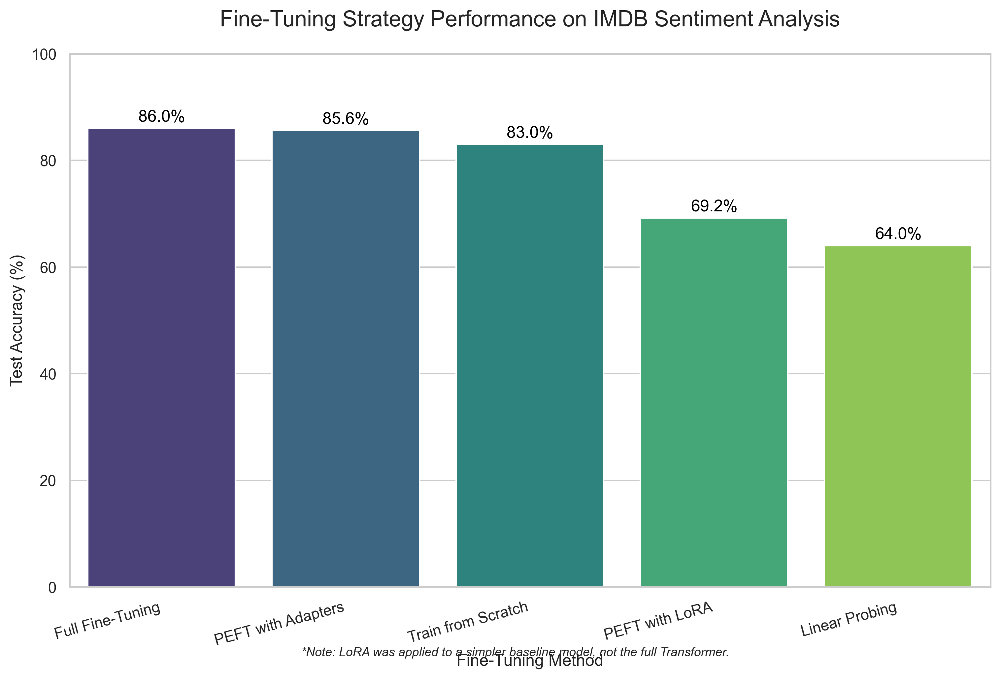

# 🚀 The Transformer Adaptation Playbook: An Empirical Study of Fine-Tuning Techniques

<div align="center">

*This project presents a systematic investigation into adapting pre-trained Transformer models, comparing the trade-offs between performance, computational cost, and parameter efficiency across foundational and state-of-the-art fine-tuning methods.*

</div>

<p align="center">
  
  
  
</p>

---

## 📈 Key Results & Analysis

This project's core contribution is an empirical comparison of various fine-tuning strategies on a standardized task (IMDB sentiment analysis). The results clearly demonstrate that **Parameter-Efficient Fine-Tuning (PEFT) methods offer a superior balance of performance and efficiency.**

### Performance: PEFT Matches Full Fine-Tuning

Our experiments show that PEFT techniques, specifically **Adapters**, can achieve performance parity with full fine-tuning, which retrains every parameter in the model. This is a critical finding for deploying models efficiently.

<p align="center">
  
</p>

*<p align="center"><b>Figure 1:</b> Both Full Fine-Tuning and PEFT (Adapters) achieve top-tier accuracy (~86%). This demonstrates that we can attain SOTA performance without the immense cost of full retraining.</p>*

---

### Efficiency: The >96% Parameter Reduction of PEFT

The motivation for PEFT is vividly illustrated by comparing the number of trainable parameters. Our from-scratch implementation of **LoRA** required updating dramatically fewer weights than a traditional full-layer update.

<p align="center">
  
</p>

*<p align="center"><b>Figure 2:</b> LoRA achieved its results by training only **456 parameters** in the target layer—a **96.4% reduction** compared to the 12,800 parameters of a standard dense layer.</p>*

---

## 🔬 Methodology & Scope

This repository follows a structured, multi-stage methodology to provide a comprehensive analysis of Transformer adaptation:

1.  **Foundation & Baselines:** We begin by building models and pre-training them from scratch to understand the fundamental mechanics and establish performance baselines.
2.  **Classic Transfer Learning:** We implement the standard pre-train/fine-tune paradigm, demonstrating its effectiveness and high computational cost.
3.  **Parameter-Efficient Implementations:** We build and integrate two popular PEFT methods, **Adapters** and **LoRA**, from scratch to demystify their inner workings.
4.  **Comparative Analysis:** All methods are systematically evaluated on a common downstream task (sentiment classification) to provide a direct comparison of their performance and efficiency trade-offs.
5.  **Practical Application:** We conclude by applying these techniques to advanced use cases, including multi-class classification and instruction-tuning a conversational AI.

---

## 📚 Repository Contents: A Guided Tour

The project is organized into a series of notebooks that build upon each other, taking you from core concepts to advanced implementations. Click on any visualization to navigate directly to the notebook.

| #  | Notebook                                                                        | Core Contribution & Skills Demonstrated                                                                                                                          | Key Visualization                                                                                                                                                                                                                            |
| -- | ------------------------------------------------------------------------------- | ---------------------------------------------------------------------------------------------------------------------------------------------------------------- | -------------------------------------------------------------------------------------------------------------------------------------------------------------------------------------------------------------------------------------------- |
| **01** | **[Pre-training & Full Fine-Tuning](./01_Pretraining_and_Full_Finetuning.ipynb)** | Implements the foundational pre-train and full fine-tune workflow, setting a performance baseline with a custom Transformer in **PyTorch**.                  | [](./01_Pretraining_and_Full_Finetuning.ipynb)                                                                                                                            |
| **02** | **[Inference with Hugging Face](./02_Inference_with_HuggingFace.ipynb)** | A practical cookbook for applying pre-trained models to diverse NLP tasks (generation, translation, classification) using the **Hugging Face `pipeline()`**. | *(N/A - Focuses on inference patterns)* |
| **03** | **[Building a LM from Scratch](./03_Building_a_LM_from_Scratch.ipynb)** | Demystifies language models by training a custom tokenizer and pre-training a BERT-style model with **Masked Language Modeling (MLM)** on a new corpus.         | *(N/A - Focuses on the pre-training process)* |
| **04** | **[PEFT with Adapters](./04_PEFT_with_Adapters_vs_Full_Finetuning.ipynb)** | Introduces PEFT by implementing "Adapter" modules from scratch and empirically comparing their performance against full fine-tuning and linear probing.          | [](./04_PEFT_with_Adapters_vs_Full_Finetuning.ipynb)                                                                                                                     |
| **05** | **[PEFT Deep Dive: LoRA from Scratch](./05_PEFT_Deep_Dive_into_LoRA_Scratch.ipynb)** | Provides a from-scratch implementation of **LoRA**, demystifying its matrix decomposition and demonstrating a >96% parameter reduction.                       | [](./05_PEFT_Deep_Dive_into_LoRA_Scratch.ipynb)                                                                                                                                  |
| **06** | **[Advanced Fine-Tuning Applications](./06_Advanced_Finetuning_BERT_to_OPT.ipynb)** | Showcases end-to-end applications: fine-tuning **BERT** for multi-class classification and instruction-tuning **OPT** for conversational AI.                   | <a href="./06_Advanced_Finetuning_BERT_to_OPT.ipynb"><br><b>vs.</b><br></a> |
---

## 🛠️ Core Technologies & Skills Demonstrated

This project showcases a broad set of skills essential for modern AI/ML engineering and research.

- **AI/ML Concepts:** Transfer Learning, Full Fine-Tuning, Parameter-Efficient Fine-Tuning (PEFT), Adapters, Low-Rank Adaptation (LoRA), Masked Language Modeling (MLM), Causal Language Modeling, Supervised Fine-Tuning (SFT).
- **Frameworks:** PyTorch, Hugging Face (`transformers`, `datasets`, `trl`, `accelerate`).
- **Models:** BERT, GPT-2, OPT, T5, Custom Transformers.
- **Engineering:** From-scratch model and layer implementation, modular code structure, data processing pipelines, and results visualization with Matplotlib & Seaborn.

---

## Reproduction & Setup

To run the experiments and explore the notebooks, follow these steps.

### 1. Prerequisites
- **Python 3.9+**
- An environment manager like `conda` or `venv` is recommended.

### 2. Installation
First, clone the repository to your local machine and install the required dependencies using the `requirements.txt` file.

# 1. Clone the repository
```bash
git clone https://github.com/nabeelshan78/Transformer-Adaptation-Playbook.git
cd Transformer-Adaptation-Playbook
```

# 2. Install the required packages
```
pip install -r requirements.txt
```

### 3. Usage
Once the setup is complete, you can interact with the project by following the experiments step-by-step through running all notebooks


